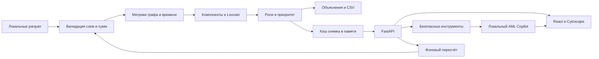

# Архитектура

```mermaid
flowchart LR
  P[Локальные parquet] --> V[Валидация схем и сумм]
  V --> M[Метрики графа и времени]
  M --> C[Компоненты и Louvain]
  C --> R[Роли и приоритет]
  R --> E[Объяснения и CSV]
  R --> S[Кэш снимка в памяти]
  S --> A[FastAPI]
  A --> U[React и Cytoscape]
  A --> T[Безопасные инструменты]
  T --> L[Локальный AML Copilot]
  L --> U
  A --> B[Фоновый пересчёт]
  B --> V
```

Инструменты помощника читают готовый снимок. Произвольные команды, SQL и Python не исполняются. Данные не отправляются внешним сервисам.
